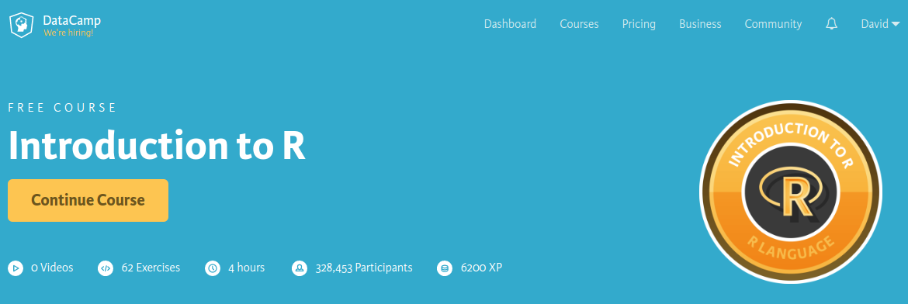
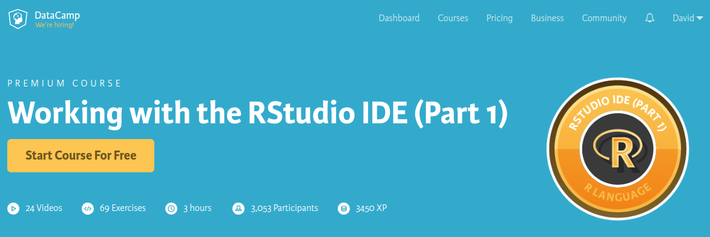

```{r setup, include=FALSE}
knitr::opts_chunk$set(echo = TRUE)
```

Tutorial desenvolvido para o **III Meetup de Machine Learning** de Belo Horizonte.

## Preparação do Ambiente de Desenvolvimento

Para instalar o **R** e as dependendências necessárias, execute os seguintes passos:

1. Instale o [Anaconda](https://www.continuum.io/downloads) ou o [Miniconda](https://conda.io/miniconda.html) (versão reduzida) de acordo com a versão do Python de sua preferência, `python2` ou `python3`. Reinicie o sistema operacional após a instalação. 
1. Instale o [R Essentials](https://anaconda.org/r/r-essentials):
```
conda install -c r r-essentials
```
1. Instale a IDE [RStudio](https://www.rstudio.com/products/rstudio/download/):
```
conda install -c r rstudio
```

## Primeiros Passos no R

Para começar no **R**, recomendamos o curso [Introduction to R](https://www.datacamp.com/courses/free-introduction-to-r) do [Datacamp](https://www.datacamp.com/). Nesse curso você vai aprender a sintaxe básica do **R**, asssim como as principais estruturas de dados da linguagem. É um curso gratuito, extremamente prático e leva apenas **4 horas** para concluir. Depois disso você ganha um certificado online!

<a href="https://www.datacamp.com/courses/free-introduction-to-r" target="_blank"></a>

Em seguida, recomendamos o primeiro capítulo do curso **Working with the RStudio IDE** [Parte 1](https://www.datacamp.com/courses/working-with-the-rstudio-ide-part-1). Nele você irá se familiarizar com a [IDE RStudio](https://www.rstudio.com/products/rstudio), que recomendamos fortemente para trabalhar com **R**. Esse capítulo também é gratuito e leva cerca de **1 hora** para concluir. A [Parte 2](https://www.datacamp.com/courses/working-with-the-rstudio-ide-part-2) do curso é voltada para desenvolvimento de bibliotecas de funções em **R**, que não é o foco de nosso tutorial.

<a href="https://www.datacamp.com/courses/working-with-the-rstudio-ide-part-1" target="_blank"></a>

## Bibliotecas de Data Science

O conjunto de bibliotecas do **R** voltadas para **Data Science** foi denominado recentemente de [tidyverse](http://tidyverse.org/). As bibliotecas **core** do **tidyverse** são:

- [ggplot2](https://github.com/hadley/ggplot2) para **visualização de dados**.
- [dplyr](https://github.com/hadley/dplyr) para **manipulação de dados**.
- [tidyr](https://github.com/hadley/tidyr) para **limpeza e formatação de dados** ([Data Tidying](ftp://cran.r-project.org/pub/R/web/packages/tidyr/vignettes/tidy-data.html)).
- [readr](https://github.com/hadley/readr) para **importação de dados**.
- [stringr](https://github.com/hadley/stringr) para **manipulação de strings**.
- [lubridate](https://github.com/hadley/lubridate) para **manipulação de datas**.
- [purrr](https://github.com/hadley/purrr) para **programação funcional**.
- [forcats](https://github.com/hadley/forcats) para **manipulação de dados categóricos**. 
- [rvest](https://github.com/hadley/rvest) para **web scraping**.

Clicando no *link* de cada uma dessas bibliotecas você irá notar que todas elas foram criadas por [Hadley Wickham](http://hadley.nz/), um estatístico, hoje *Chief Scientist* na [RStudio](http://rstudio.com/), que revolucionou a linguagem **R** nos últimos anos. As ferramentas que ele vem criando, juntamente com todas as bibliotecas desenvolvidas e mantidas pela da equipe da [RStudio](https://www.rstudio.com/online-learning/), ao contrário do que muitos desenvolvedores acreditam, têm permitido usar o **R** para **Data Science** e **Machine Learning** em produção.

<a href="https://priceonomics.com/hadley-wickham-the-man-who-revolutionized-r/" target="_blank"></a>

Se você deseja aprender a utilizar tais bibliotecas efetivamente, recomendamos o livro [R for Data Science](http://r4ds.had.co.nz/), que tem Hadley Wickham como co-autor. Esse é o guia definitivo para quem quer aprender **Data Science** usando **R**. 

<a href="http://r4ds.had.co.nz/" target="_blank"></a>

## EDA Usando R

Neste tutorial vamos aprender a usar as ferramentas anteriormente citadas para fazer **Análise Exploratória de Dados** (EDA - *Exploratory Data Analysis*), uma parte essencial do trabalho de um cientista de dados, cujo principal objetivo é conhecer melhor os dados antes da aplicação das técnicas de **Machine Learning**.

Vamos ao trabalho? Acesse o material: [Análise de Dados na Prática usando R]().
